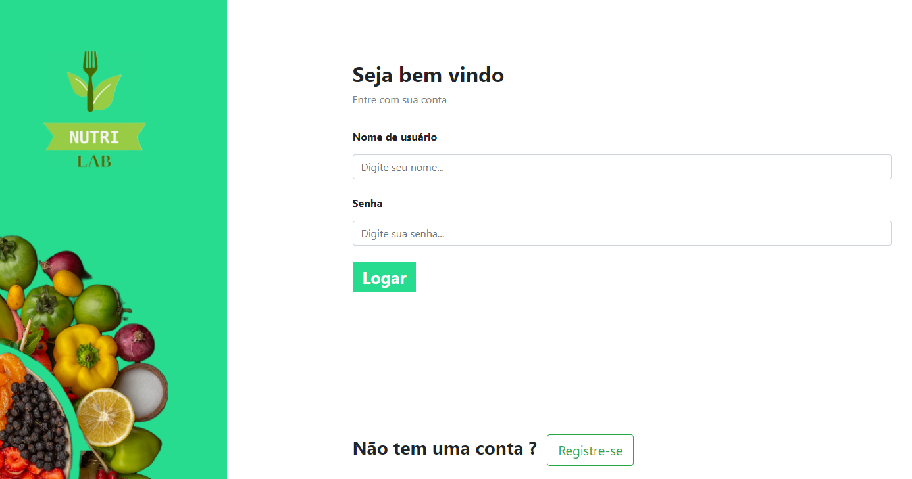
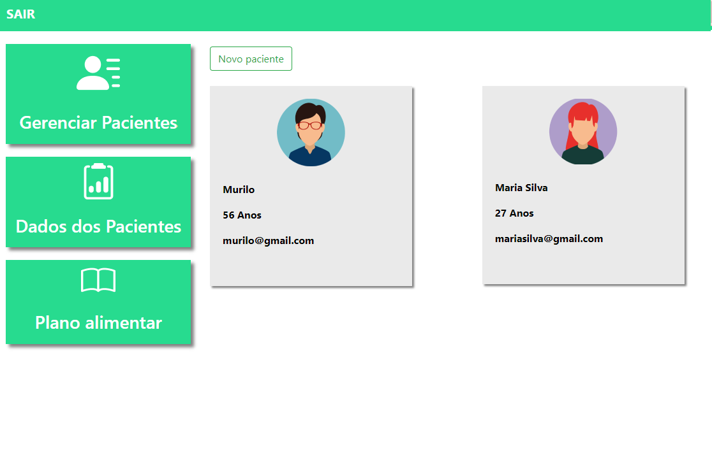

<h1>NUTRILAB</h1> 

  

### Tópicos 

:small_blue_diamond: [Descrição do projeto](#descrição-do-projeto)

:small_blue_diamond: [Funcionalidades](#funcionalidades)

:small_blue_diamond: [Deploy da Aplicação](#deploy-da-aplicação-dash)

... 

## Descrição do projeto 

  NutriLab é um programa projetado para atender as necessidades de um(a) nutricionista em seu dia-dia no trabalho. 
  O app permite o gerenciamento de pacientes de forma mais organizada e prática. 

## Funcionalidades
O Primerio passo para utilizar o NUTRILAB é fazer um cadastro na página inicial:

:heavy_check_mark: Funcionalidade 1  

Logo após o login, o profissional nutricionista vai acessar a página com seus pacientes cadastrados

:heavy_check_mark: Funcionalidade 2  

:heavy_check_mark: Funcionalidade 3  

:heavy_check_mark: Funcionalidade 4  

## Deploy da Aplicação :dash:

> Link do deploy da aplicação: https://certificates-for-everyone-womakerscode.netlify.app/
>  

## Linguagens, dependencias e libs utilizadas:

- [React](https://pt-br.reactjs.org/docs/create-a-new-react-app.html)
- [React PDF](https://react-pdf.org/)

...

Veja aqui [o resultado final](http://18.221.247.75:8000/)
