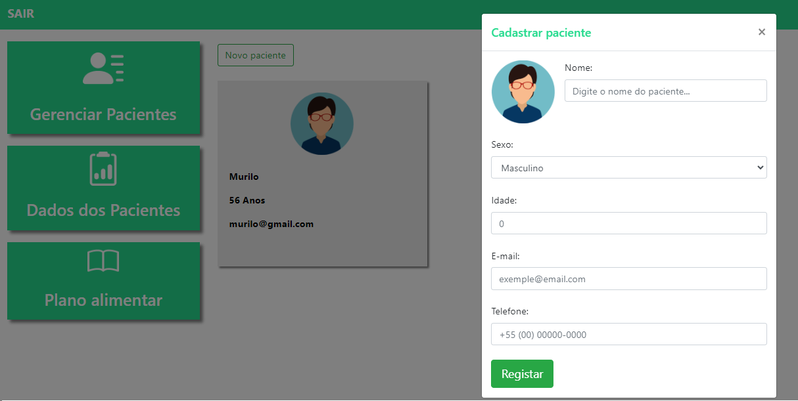
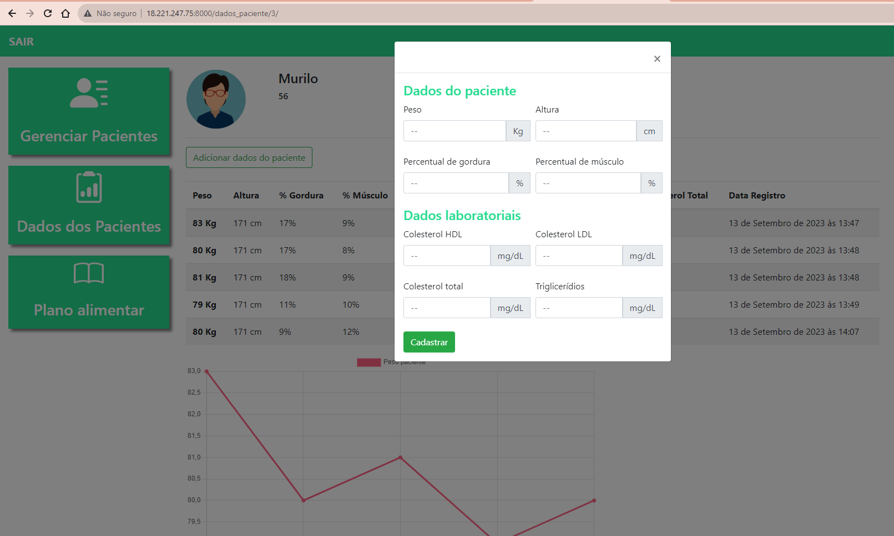
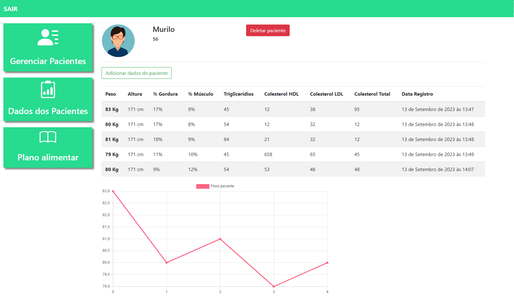
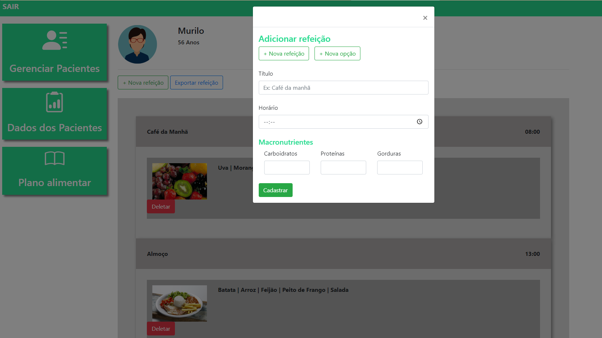
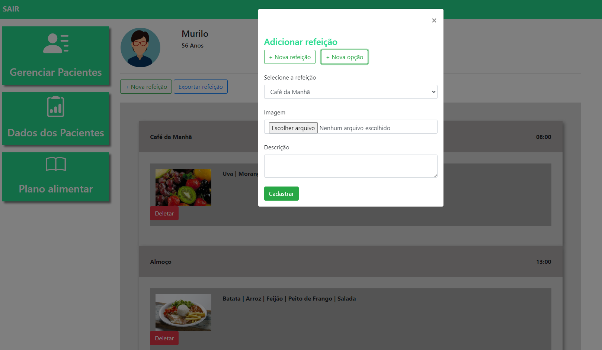

<h1>NUTRILAB</h1> 

  

### Tópicos 

:small_blue_diamond: [Descrição do projeto](#descrição-do-projeto)

:small_blue_diamond: [Funcionalidades](#funcionalidades)

:small_blue_diamond: [Deploy da Aplicação](#deploy-da-aplicação-dash)

## Descrição do projeto 

  NutriLab é um programa projetado para atender as necessidades de um(a) nutricionista em seu dia-dia no trabalho. 
  O app permite o gerenciamento de pacientes de forma mais organizada e prática. 

## Funcionalidades
O Primerio passo para utilizar o NUTRILAB é fazer um cadastro na página inicial:

:heavy_check_mark: Funcionalidade 1  

Logo após o login, o profissional nutricionista vai acessar a página com seus pacientes cadastrados

:heavy_check_mark: Funcionalidade 2  

Podendo cadastrar novos pacientes

:heavy_check_mark: Funcionalidade 3  

Cadastrar dados pessoais e dados laboratoriais 

:heavy_check_mark: Funcionalidade 4  

Visualizar os dados cadastrados em suas respectivas datas.
Mostrando também um gráfico com a variação de peso desse paciente ao longo do tempo.

:heavy_check_mark: Funcionalidade 5  

Cadastrar um plano alimentar para cada paciente

:heavy_check_mark: Funcionalidade 6

E cadastrar diferentes opções de refeições para esse paciente escolher 

## Deploy da Aplicação :dash:

O deploy foi realizado pela AWS 

> Link do deploy da aplicação: http://18.221.247.75:8000/
>  

## Linguagens, dependencias e libs utilizadas:

- Python
- Django

